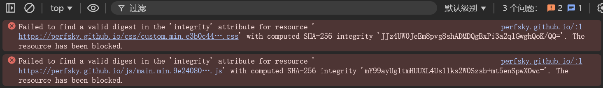

+++
title = "博客搭建指南"
keywords = ["Blog","Tutorial"]
description = "简单的hugo博客搭建指南"
date = "2024-10-13"
taxonomies = "1"
+++

> 以Hextra主题为例的Hugo博客搭建指南

## 准备工作

- 安装好Go和Hugo(extended version)
- 配置好Git
- 拥有一个域名(可选)

## 速通


  施工中


1. 建立两个仓库，分别存放源代码和生成的静态文件
2. Hugo初始化博客，目标文件夹与源代码仓库同名
3. 拉取Hextra主题到./themes/hextra，拉取静态文件仓库到./public（使用`git submodule`）
4. 配置hugo.yaml，参考exampleSite
5. 写一点东西
6. 生成静态文件，检查，推送到远程仓库
7. 配置Github Pages到静态文件仓库中
8. (可选) CLoudflare 绑定域名解析

## 一些容易踩的坑

### 文件完整性校验不通过导致博客功能失效[^1]


为确保脚本或者样式表不被恶意篡改，网页会使用`integrity`来校验文件完整性，如果计算的SHA-256值和指定的不匹配，则浏览器拒绝加载此资源。
而在hugo生成静态资源后，如果尝试将其上传到github，有可能文件中的换行符会被git自动转换，导致本地文件和云端文件校验值不同。
解决方法是关闭git自带的CRLF<-->LF转换：

```bash
git config --global core.autocrlf false
```

或者[指定某个仓库不转换](https://docs.github.com/zh/get-started/getting-started-with-git/configuring-git-to-handle-line-endings#per-repository-settings)

### Cloudflare Pages自动构建过程出错

暂时未找到解决方法，替代品是直接让它部署生成后的静态页面

## 参考资料

- [Hextra](https://imfing.github.io/hextra/zh-cn/docs/getting-started/)
- [Hugo](https://www.gohugo.org)
- [头部自定义参数](https://www.gohugo.org/doc/content/front-matter/)

[^1]: [Issue](https://github.com/kubernetes/website/issues/25414)
