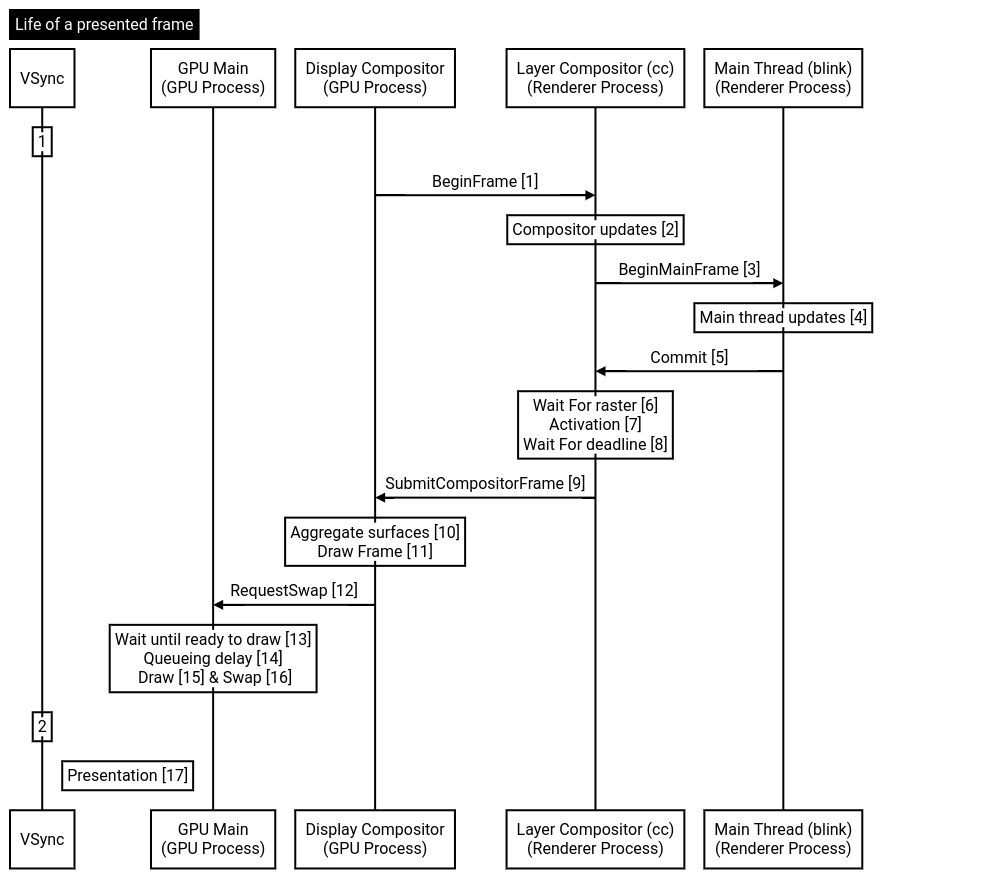
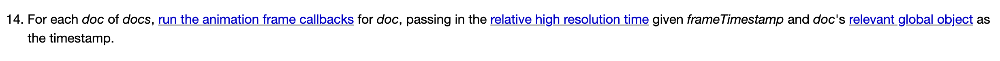
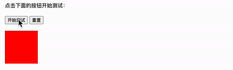

+++
title = "从rAF()探究浏览器帧渲染流程"
keywords = ["Blog","Frontend",'Browser',"Render"]
description = "从requestAnimationFrame()探究浏览器帧渲染流程"
date = "2025-04-13"
taxonomies = "1"
slug = "how-raf-and-frame-works"
+++

## requestAnimationFrame()

MDN对`rAF()`的解释：

`window.requestAnimationFrame()` 方法会告诉浏览器你希望执行一个动画。它要求浏览器在下一次重绘之前，调用用户提供的回调函数。对回调函数的调用频率通常与显示器的刷新率相匹配。最常见的刷新率是 60hz。

使用`window.cancelAnimationFrame(rafId)`作用于`rAF()`的返回值，取消回调函数执行操作。

> 若你想在浏览器下次重绘之前继续更新下一帧动画，那么回调函数自身必须再次调用 `requestAnimationFrame()`。`requestAnimationFrame()` 是一次性的。

`requestAnimationFrame()` 是一个宏任务。

使用示例：

```jsx
let requestId;
function init(val) {
  console.log("回调发生在时间:", val);
  // rAF执行的回调函数只有一个参数val，是上一帧渲染的结束时间戳
  requestId = requestAnimationFrame(init);
}
requestAnimationFrame(init);

function stop() {
  cancelAnimationFrame(requestId);
}
```

## 特点以及机制

### 为什么使用`rAF()`而不是`setTimeout()`？

#### 计时精确，帧生成时间稳定

帧生成时间指的是每个完整帧从开始到结束渲染的时间。一般情况下，帧生成时间要小于当前刷新率下每帧持续显示的时间，这样才能确保画面显示稳定。否则可能会导致画面操作卡顿不跟手等问题。


`requestAnimationFrame()` 的间隔时间由浏览器决定。浏览器内核监听显示器的VSync（垂直同步）信号，并自动同步频率，使`requestAnimationFrame()` 能够以精确的16.67ms触发回调（60帧的情况下）。

而`setTimeout()` 、`setInterval()`等方法会受到JS事件队列执行的影响，每次触发回调的时长会发生抖动。

#### 自带FPS Meter监控帧时长

浏览器内部会使用`requestAnimationFrame()` +高精度计时器记录帧生成时间、FPS、任务执行时间等数据，如果过长或者触发阈值，浏览器会延迟显示（导致FPS下降），或者主动跳过当前帧的渲染（更新状态但是不光栅化）。

#### 页面处于后台或者元素不可见时暂停

为了提高性能和电池寿命，大多数浏览器都会暂停在后台选项卡或者隐藏的 `<iframe>` 中运行的 `requestAnimationFrame()` 。

### 浏览器一帧的生命周期

简单来说，一个帧的完整生命周期如下：


1. 在主线程中处理输入、JS事件（包括同步和异步任务）
2. 由VSync信号驱动，检测是否需要更新页面，并触发一些系统事件
3. 使用`requestAnimationFrame()` 执行回调，这是动画系统最后的同步操作DOM的时机
4. 计算样式，处理Layout（回流）等内容
5. 计算/标记重绘部分，交给GPU或者渲染线程进行光栅化

`rAF()` 在这里负责接受VSync同步信号，执行动画回调。

而在Chromium文档中，一帧从开始到展现是如下的步骤：



整个过程首先由四个进程组成：

1. Main Thread(blink): 主渲染进程，执行JS、布局和样式更新计算，把渲染树交给Layer Compositor
2. Layer Compositor (cc): 渲染进程，负责合成层调度、调用光栅化线程、提交frame给Display Compositor
3. Display Compositor: 副GPU进程，汇总Layer Compositor的frame，发起GPU绘制
4. GPU Main: 真正执行GPU绘制、提出SwapBuffer请求，将buffer内容贴到屏幕

按顺序，分别会进行如下操作：

1. Display Compositor发起帧准备，让Layer Compositor做层更新工作。
2. Layer Compositor告知Main Thread进行计算样式/布局/重绘渲染树。
3. Main Thread返回Render Tree给Layer Compositor。
4. Layer Compositor等待光栅化完成（这一步可能在其他的线程甚至进程中），然后激活形成新的Layer Tree，等待直到GPU规定的提交deadline，再提交给Display Compositor。（这里，如果之前的工作耗时过长，处理管线可能会丢弃这一更新，导致丢帧）
5. Display Compositor收集所有的CompositorFrame（和DidNotProduceFrame，如果丢帧），整合成单一的CompositorFrame。
6. Display Compositor进行绘制操作（生成绘制命令），提交给GPU Main，请求交换Buffer。
7. GPU Main等到上一个frame处理完成后再进行（硬件级）GPU绘制，使用Display Compositor的绘制命令进行绘制，绘制使用的是Chromium的Skia图形库记录的Deferred Display List。
8. 如果上一个frame还没有显示完，或者队列太满则会被阻塞，否则进行SwapBuffer请求（把已经画好的back buffer和当前显示的front buffer进行交换，双缓冲）
9. 交换完buffer之后，等待对齐下一个VSync再显示到显示器中。

用流程图简化表示如下：

```plaintext
VSync
↓
GPU 进程（Display Compositor） → 渲染进程（Compositor Thread） → 渲染进程（Main Thread）做 JS/Layout
↓
渲染进程 LayerCompositor 栅格化 + 提交 frame
↓
GPU 进程（汇总、绘制、Swap）
↓
显示在屏幕上
```

[参考资料](https://chromium.googlesource.com/chromium/src/+/HEAD/docs/life_of_a_frame.md)

## 拓展

`requestIdleCallback()` 是浏览器提供的一种低优先级任务调度API，允许开发者在浏览器空闲时期执行其他任务。这里的浏览器空闲时期指的是：

1. 前一帧渲染完成到后一帧开始渲染的间隔
2. 用户处于idle状态，并且没有任何动画执行的时期

特点：

1. 不能保证任务在何时执行。如果渲染事件紧密，可能腾不出执行`rIC()` 的时间。
2. 空闲回调时，任务执行的上限时间是`50ms` ，目的是*”ensure responsiveness to new user input within the threshold of human perception”[^1]*，防止用户突然操作感受到页面阻塞。
3. 兼容性不理想（Safari全版本不支持）；触发频率较低；早期SWR使用`rIC()` 会和浏览器插件冲突。

## 佚事

### 其一

查阅资料时，发现早期浏览器对`requestAnimationFrame()` 的执行顺序不同，Chrome v71、Firefox等符合标准的浏览器会在style/layout/paint之前、JS事件循环之后触发回调，而IE、Edge、Safari则是在style/layout/paint之后触发。

而HTML标准里，`requestAnimationFrame()` 被规定在更新渲染中（即render下一帧之前）



因此使用以下的代码，在标准下应该从左开始移动：

```jsx
const test = document.querySelector(".test");
const testButton = document.getElementById("testButton");
const resetButton = document.getElementById("resetButton");
test.style.transform = "translate(0, 0)";
test.style.transition = "none";

testButton.addEventListener("click", () => {
  // 重置状态
  test.style.transition = "none";

  // 设置初始变换
  test.style.transform = "translate(400px, 0)";

  requestAnimationFrame(() => {
    test.style.transition = "transform 3s linear";
    test.style.transform = "translate(200px, 0)";
  });
});

resetButton.addEventListener("click", () => {
  test.style.transition = "none";
  test.style.transform = "translate(0, 0)";
});
```

但是，在笔者的浏览器（较新的Safari+Chrome）上，均会从右向左移动，似乎把回调推迟到了下一帧，这就很奇怪了，可能是浏览器的优化策略所致。



[参考资料](https://zhuanlan.zhihu.com/p/64917985)

### 其二

React 16.2.0弃用了`requestAnimationFrame()` ，采用message event loop。不仅是因为上文中的回调时机问题，也是因为`MessageChannel` 较为稳定，不会像`setTimeout()` 一样有4ms的最小延迟，也不会像`requestAnimationFrame()`一样触发事件受浏览器更新机制和VSync的影响。它既能及时让出主线程，又能够确保消息的稳定传递。

[GitHub PR](https://github.com/facebook/react/pull/16214)

[参考资料](https://kanglover.github.io/2024/09/19/react-requestIdleCallback/)

[^1]: [HTML Standard 8.1.7.3 - 5.2.1 Note](https://html.spec.whatwg.org/multipage/webappapis.html)
