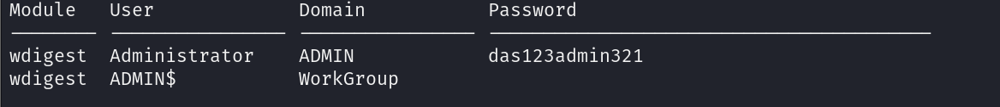
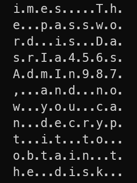
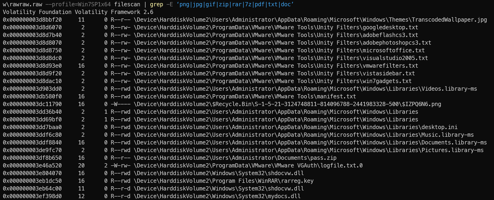
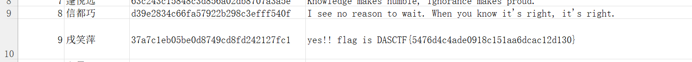

+++
title = "[西湖论剑2024初赛] MISC3-easy_rawraw WriteUp"
keywords = ["Misc","CTF","Cyber Security"]
description = "[西湖论剑2024初赛] MISC3-easy_rawraw WriteUp"
date = "2024-02-01"
taxonomies = "1"
slug = "xihu2024-initial-misc"
+++

> easy raw! many passwords!

首先用volatility+mimikatz可以爆出windows账户密码das123admin321
`vol.py --plugins=./plugins -f ./rawraw.raw --profile=Win7SP1x64 mimikatz`

剪贴板中，有另一个密码DasrIa456sAdmIn987，用来解压mysecretfile.rar
`vol.py --plugins=./plugins -f ./rawraw.raw --profile=Win7SP1x64 clipboard`

mysecretfile用了veracrypt加密，需要另一个密码，所以继续找线索
搜索相关文件，可以发现pass.zip，并用dumpfiles提取
`vol.py --plugins=./plugins -f ./rawraw.raw --profile=Win7SP1x64 filescan | grep -E ‘png|jpg|gif|zip|rar|7z|pdf|txt|doc’`
`vol.py --plugins=./plugins -f ./rawraw.raw --profile=Win7SP1x64 dumpfiles -Q 0x000000003df8b650 -D .\`
图片末尾提取出加密压缩包，ARCHPR爆破得密码20240210，解压得到pass.txt，挂载之后有一个隐藏文件.xlsx，也要密码，试出来就是之前得到的账户密码das123admin321

打开发现第10行被隐藏了，flag就在其中
> "DASCTF{5476d4c4ade0918c151aa6dcac12d130}"
