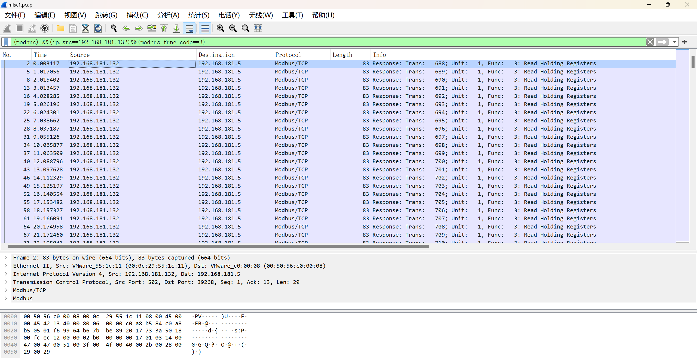
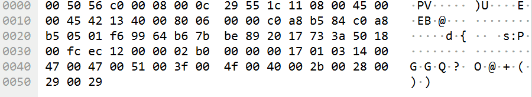
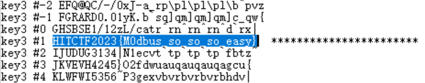
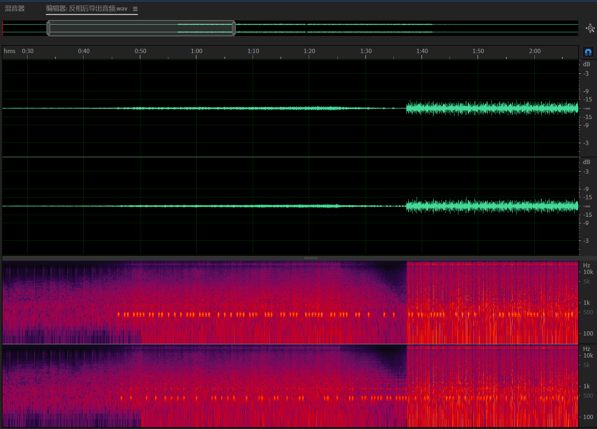
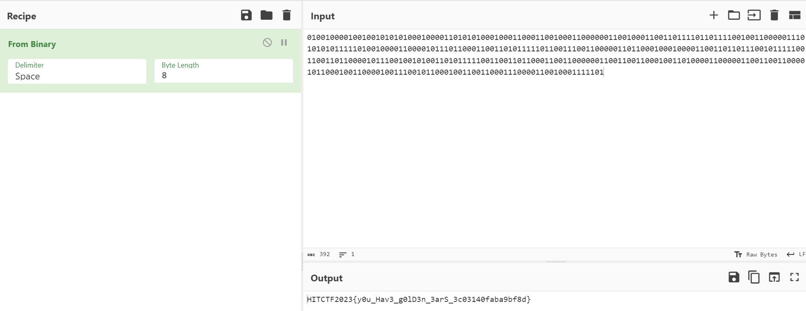

+++
title = "[HITCTF2023] MISC1&2 WP"
keywords = ["Misc","CTF","Cyber Security"]
description = "[HITCTF2023]MISC1&2 WP"
date = "2023-11-26"
taxonomies = "1"
slug = "hitctf2023-misc"
+++

## MISC1 - leftover file

> There is traffic packet captured by engineers on the intranet on the controlled machine. Please analyze the traffic packet and obtain the flag.

拿到一个捕获文件，有大量Modbus/TCP协议的流量，并且从192.168.181.132 <--> 192.168.181.5的最多。
应用过滤：(modbus) &&(ip.src\==192.168.181.132)&&(modbus.func_code\==3)，这个的意思是过滤modbus协议，ip来源为192.168.181.132，且功能码为读保持的流量。

追踪流没发现什么线索，最后发现每条流量的最后部分，都会有规律地刷新：

提取这一部分的字符串：
GGQ?O@+())pA#VSebM\`[J]XGZUDIDUZ]
用工具解密得到flag

## MISC2 - H1F1

> Some audiophiles claim they can hear the difference between 320K mp3 and lossless audio.
~~无损听不出来，但是192k和320k的mp3还是很容易分辨的~~

给了一首歌的flac和mp3版本，根据描述应该是让我们从两个音频的差别来找线索
首先用audition将其中一首反相，再和另外一首进行混音，预览页面可以看到频谱有异常部分，并且左右耳能听到规律性的“嘟”声。

猜测是二进制序列，把上面的部分（左声道）视为0，下面视为1，提取出二进制序列：
`01001000010010010101010001000011010101000100011000110010001100000011001000110011011110110111100100110000011101010101111101001000011000010111011000110011010111110110011100110000011011000100010000110011011011100101111100110011011000010111001001010011010111110011001101100011001100000011001100110001001101000011000001100110011000010110001001100001001110010110001001100110001110000110010001111101`
解码得到flag

