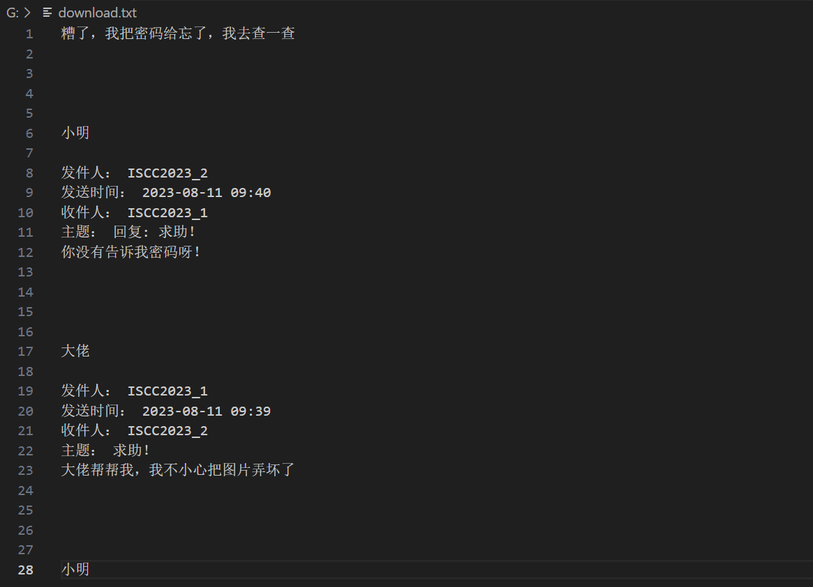
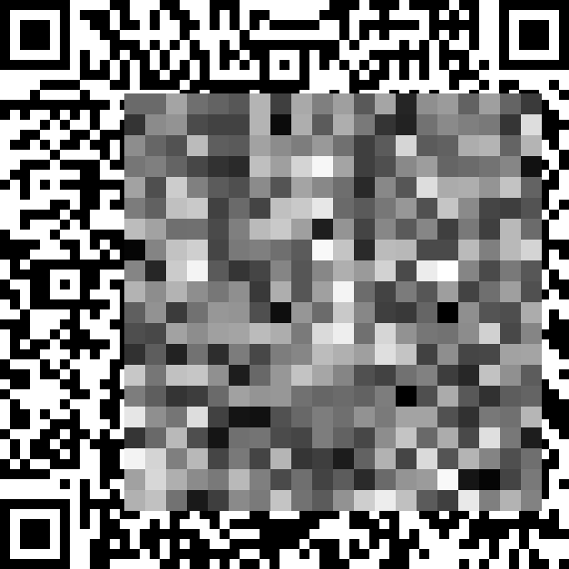

+++
title = "[ISCC2023线下] MISC1 WP"
keywords = ["Misc","CTF","Cyber Security"]
description = "【ISCC2023线下】MISC1 帮帮小明writeup"
date = "2023-10-21"
taxonomies = "1"
slug = "iscc2023-beijing-fin-misc"
+++

## 考点

流量分析，TLS，二维码修复

## 解题步骤

首先速览一遍帮帮小明.pcapng，发现里面的协议有IMAP和TLS，这部分可能有线索
打开统计->会话，TCP栏有两个终点为25端口的地址，追踪流量，是两次对话

发现一个压缩包

保存，发现有密码，里面是一个加密后的文件mosaic.bmp，用zipcenop排除了伪加密的可能性，所以密码应该在另一个tcp流中

发现一段明文，用的gb2312编码，用vscode打开：

害，怎么密码忘了呢，只能往后面慢慢找了
这里附件还给了tls-log.txt，猜测需要解密tls密文，在编辑——>首选项——>Protocols——>TLS——>(Pre)-Master-Secret log filename这里加入即可
最后在某个TLS流找到了密码`cAn_yOU_hElp_mE`

解压压缩包，得到图片mosaic.bmp

还好队友见过原题，直接把脚本放了上来，参数甚至一点没变就可以用

```python {linenos=table,linenostart=1}
import math
import numpy as np
from PIL import Image
from numpy.lib import ndindex

X, Y = 103, 137
N = 20
BOX_SIZE = 23
PIXEL_SIZE = 11

def set_pix(array, x, y, val):
    '''将图片数组 array 中第 (x, y) 个二维码格设为 val
    '''
    x1 = x * PIXEL_SIZE
    x2 = (x+1) * PIXEL_SIZE
    y1 = y * PIXEL_SIZE
    y2 = (y+1) * PIXEL_SIZE
    array[x1:x2, y1:y2] = val

# check box[i, j]
def check(ar, i, j):
    '''判断图片数组 ar 生成的马赛克的第 (i, j) 个块是否要求的相符
    即比较数组 ar 对应位置的平均值和马赛克数组的对应格
    '''
    x1 = X + i*BOX_SIZE
    x2 = X + (i+1)*BOX_SIZE
    y1 = Y + j*BOX_SIZE
    y2 = Y + (j+1)*BOX_SIZE
    # print('box:\n', ar[x1:x2, y1:y2])
    mean = ar[x1:x2, y1:y2].mean()
    return math.floor(mean) == mosaic[i, j]

def set_pixels(ar, uncertains, t):
    for k, pos in enumerate(uncertains):
        color = ((t >> k) & 1) * 255
        set_pix(ar, pos[0], pos[1], color)

def solve():
    error = False
    # for every box in pixelated area.
    for (i, j) in np.ndindex(mosaic.shape):
        # 考虑马赛克的每个格子 (i, j)，在 ar 中起始坐标是 (x, y)
        x = X + i*BOX_SIZE
        y = Y + j*BOX_SIZE

        # 只有从 (px, py) 开始的 3x3 个二维码格子会影响这个马赛克格子
        px = x // PIXEL_SIZE
        py = y // PIXEL_SIZE

        # 3x3 个格子中还不确定的位置
        uncertains = []
        for tx, ty in np.ndindex(3, 3):
            if not flags[px+tx, py+ty]:
                uncertains.append((px+tx, py+ty))
        if len(uncertains) == 0:
            continue

        possibles = []
        print(f'Try mosaic{(i, j)}, from pixel{(x, y)}, uncertains: {uncertains}')
        for t in range(2**len(uncertains)):
            '''遍历2^k种可能性'''
            # print('Try: {0:0{1}b}'.format(t, len(uncertains)))
            set_pixels(ar, uncertains, t)   # 将 ar 对应位置按 t 的每一位设置为对应颜色
            if check(ar, i, j):     # 判断马赛克颜色是否正确，正确则加入可能性列表
                possibles.append(t)

        if len(possibles) == 1:     # 只有一种可能性，那么是正确答案
            set_pixels(ar, uncertains, possibles[0])
            for x, y in uncertains:
                flags[x, y] = True
        elif len(possibles) > 1:
            # 多个可能就随便设一个，但是不标记为已经确定
            set_pixels(ar, uncertains, possibles[0])
            # 也可以用下面的方法，将所有可能性中颜色都相同的格子找出来，设置为确定的
            # 这样可以大大增加能解出的格子数（从 81% 提升到 88%）
            # print(possibles)
            # a = np.bitwise_and.reduce(np.asarray(possibles))
            # b = np.bitwise_or.reduce(np.asarray(possibles))
            # c = np.bitwise_xor(a, b)
            # print(f'{c:0{len(uncertains)}b}')
            # for k, pos in enumerate(uncertains):
            #     color = ((possibles[0] >> k) & 1) * 255
            #     set_pix(ar, pos[0], pos[1], color)
            #     if (c >> k) & 1 == 0:
            #         flags[pos[0], pos[1]] = True
        elif len(possibles) == 0 and len(uncertains) != 0:
            # 出现不明原因的错误
            print(f'Error: [{i}, {j}]')
            error = True
            break
        if error:
            break
        print(f'Solved: [{i}, {j}]')
    return flags.sum()  # 返回目前确定的格子数

im = Image.open('pixelated_qrcode.bmp')
ar = np.asarray(im, dtype='uint8')  # 在该数组上逐步恢复和试算二维码
mosaic = ar[X::BOX_SIZE, Y::BOX_SIZE][:N, :N].copy()    # 马赛克每格的数据
solved = ar[::PIXEL_SIZE, ::PIXEL_SIZE]     # 用于存放答案，开始取二维码每格左上角值
                                            # 注意 solved 是个引用，所以修改 ar 会跟着变
flags = (solved == 0) | (solved == 255)     # 如果某格是 0 或 255，已经能确定颜色

rd_corner = ar[PIXEL_SIZE-1::PIXEL_SIZE, PIXEL_SIZE-1::PIXEL_SIZE]  # 二维码每格右下角
rd_flags = (rd_corner == 0) | (rd_corner == 255)  # 按右下角能确定颜色的二维码格

for i, j in np.ndindex(flags.shape):
    # 按左上角和右下角边缘，将能够确定的格补全
    if flags[i, j]:
        set_pix(ar, i, j, solved[i, j])
    if rd_flags[i, j]:
        set_pix(ar, i, j, rd_corner[i, j])
flags = (solved == 0) | (solved == 255)  # 更新已确定的位置

while True:
    # 如果有新的格子被推算出来，那么继续算，否则已经没得算了
    num_ok = flags.sum()
    if solve() == num_ok:
        break

solved_im = Image.fromarray(ar)
solved_im.save('solved.bmp')
print('CertainRate:', flags.sum() / flags.size)
```

解密后读取二维码即可

## 后话

这次iscc线下真的有点抽象，关卡题打到12点还只有我们队解出来了这一题，其他队伍都是爆零，后来主办方延时到18点，结果还是没人解出来…awd也很难搞，开始3h的pwn和web私地都只有寥寥几队打进来，主办方看不下去了就开放了pwn私地，可惜当时也不会打其他队伍，就简单布防了一下，不过虽然没拿分但也没被打，还是保住了排名

总的来说是难度偏大的一次线下。
