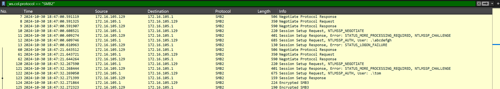
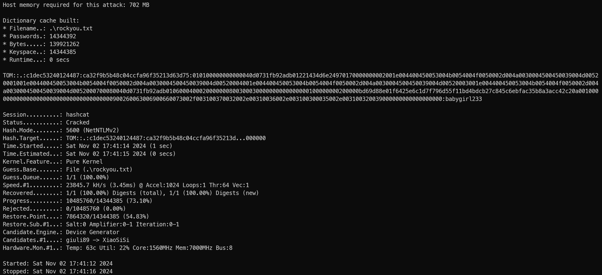
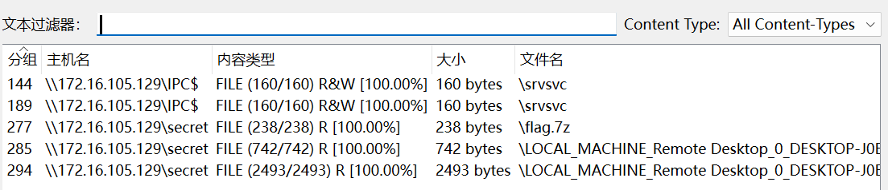
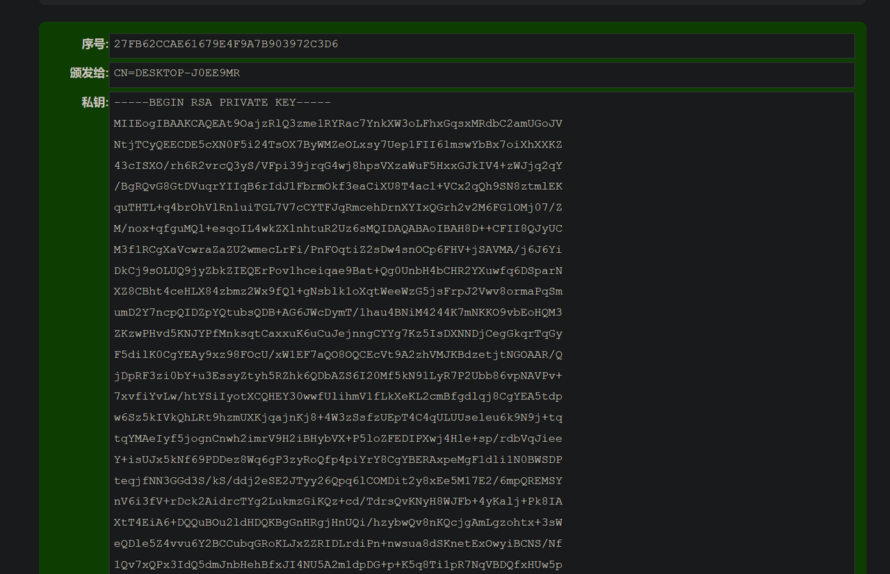
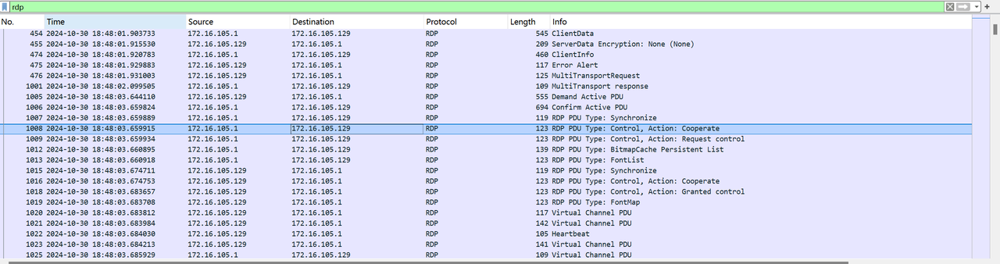
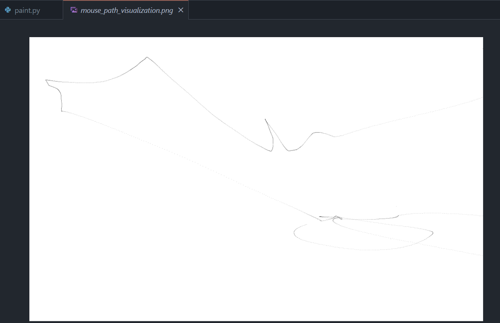
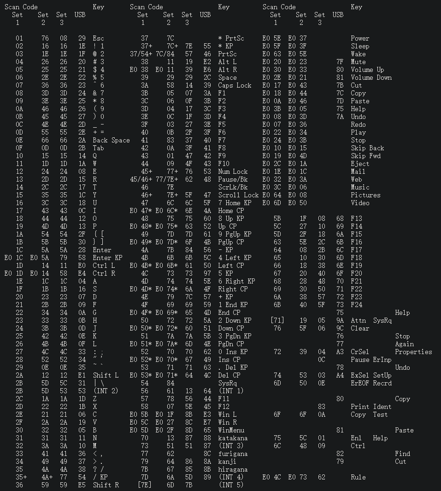

+++
title = "[强网2024初赛] MISC-谍影重重5.0 WriteUp"
keywords = ["Misc","CTF","Cyber Security", "Flow Analysis"]
description = "[强网2024初赛] MISC-谍影重重5.0 WriteUp"
date = "2024-11-10"
taxonomies = "1"
slug = "qiangwang2024-misc"
+++

## 考点

流量分析，哈希爆破，Samba协议，RDP键盘流量

## 解题步骤

首先翻找一下，发现有大量的SMB和RDP协议流量。

先从开头的SMB2建立会话入手，可知进行过一次成功的连接，并有加密流量传输。从包121、122中可提取出相关信息进行爆破：

```bash
Domain name: .
User name: tom
NTLM Server Challenge: c1dec53240124487
NTProofStr: ca32f9b5b48c04ccfa96f35213d63d75
Session Key: 5643a37f253b00b2f52df1afd48c1514
modifiedntlmv2response(去除 NTProofStr 后的一整个 NTLM Response 流): 010100000000000040d0731fb92adb01221434d6e24970170000000002001e004400450053004b0054004f0050002d004a0030004500450039004d00520001001e004400450053004b0054004f0050002d004a0030004500450039004d00520004001e004400450053004b0054004f0050002d004a0030004500450039004d00520003001e004400450053004b0054004f0050002d004a0030004500450039004d0052000700080040d0731fb92adb0106000400020000000800300030000000000000000100000000200000bd69d88e01f6425e6c1d7f796d55f11bd4bdcb27c845c6ebfac35b8a3acc42c20a001000000000000000000000000000000000000900260063006900660073002f003100370032002e00310036002e003100300035002e003100320039000000000000000000

# 组合方式：username::domain:ServerChallenge:NTproofstring:modifiedntlmv2response
tom::.:c1dec53240124487:ca32f9b5b48c04ccfa96f35213d63d75:010100000000000040d0731fb92adb01221434d6e24970170000000002001e004400450053004b0054004f0050002d004a0030004500450039004d00520001001e004400450053004b0054004f0050002d004a0030004500450039004d00520004001e004400450053004b0054004f0050002d004a0030004500450039004d00520003001e004400450053004b0054004f0050002d004a0030004500450039004d0052000700080040d0731fb92adb0106000400020000000800300030000000000000000100000000200000bd69d88e01f6425e6c1d7f796d55f11bd4bdcb27c845c6ebfac35b8a3acc42c20a001000000000000000000000000000000000000900260063006900660073002f003100370032002e00310036002e003100300035002e003100320039000000000000000000
```

使用组合后的hash在hashcat中爆破。这里尝试了很多自定义掩码都没能解出，最后用133MB的rockyou成功爆破出来：

最后得出SMB账号密码：`tom:babygirl233`，随后使用用户名、域、密码和其他内容计算Session Key。
[SMB Decryption - TryHackMe](https://malwarelab.eu/posts/tryhackme-smb-decryption/#method-2-decrypting-smb-with-the-ntlm-ha)

```python
from Crypto.Cipher import ARC4
from Crypto.Hash import MD4, MD5, HMAC

password = 'Blockbuster1'
passwordHash = MD4.new(password.encode('utf-16-le')).hexdigest()
username = 'mrealman'
domain = 'workgroup'
ntProofStr = '16e816dead16d4ca7d5d6dee4a015c14'
serverChallenge = '2a9c5234abca01e7'
sessionKey = 'fde53b54cb676b9bbf0fb1fbef384698'

responseKey = HMAC.new(bytes.fromhex(passwordHash), (username.upper()+domain.upper()).encode('utf-16-le'), MD5).digest()
keyExchangeKey = HMAC.new(responseKey, bytes.fromhex(ntProofStr), MD5).digest()
decryptedSessionKey = ARC4.new(keyExchangeKey).decrypt(bytes.fromhex(sessionKey))
print('Decrypted SMB Session Key is: {}'.format(decryptedSessionKey.hex()))
```

得到Session Key为`a3abe4d64394909a641062342ffe291b`，和Session ID`0900000000100000`组合起来，放入Wireshark中的SMB2解密。（这里的Session ID要转换为小端序）
Wireshark提取SMB文件，得到flag压缩包和某个机器的某证书


那么下一步应该就是解密RDP流量了，Wireshark导入证书即可，不过这里只给了pfx证书，需要自己转换为pem文件，密码是mimikatz（试出来的）
[春雪 - 如何使用Wireshark解密Windows远程桌面（RDP）协议](https://bbs.kanxue.com/thread-255173.htm)


导入证书后即可解密出RDP流量，其中包含鼠标的移动轨迹和键盘输入


其中鼠标轨迹无意义：


考虑输入字符(ScanCode部分)
[Scan Codes Demystified](http://www.quadibloc.com/comp/scan.htm)

这里我直接把RDP流全部转存为文本然后正则提取出了对应的键盘输入流，并和Scan Code的Set 1进行匹配：

```python
import re
input_file_path = 'rdp.txt' # 这里为导出RDP分组（解密后）的txt
output_file_path = 'keycodes_output.txt'
keycode_to_char = {
    0x01: 'Esc', 0x02: '1', 0x03: '2', 0x04: '3', 0x05: '4', 0x06: '5', 0x07: '6', 0x08: '7', 0x09: '8', 0x0A: '9', 0x0B: '0', 0x0C: '-', 0x0D: '=', 0x0E: 'BackSpace', 0x0F: 'Tab', 0x10: 'Q', 0x11: 'W', 0x12: 'E', 0x13: 'R', 0x14: 'T', 0x15: 'Y', 0x16: 'U', 0x17: 'I', 0x18: 'O', 0x19: 'P', 0x1A: '[', 0x1B: ']', 0x1C: 'Enter', 0x1D: 'LCtrl', 0x1E: 'A', 0x1F: 'S', 0x20: 'D', 0x21: 'F', 0x22: 'G', 0x23: 'H', 0x24: 'J', 0x25: 'K', 0x26: 'L', 0x27: ';', 0x28: "'", 0x29: '`', 0x2A: 'LShift', 0x2B: '\\', 0x2C: 'Z', 0x2D: 'X', 0x2E: 'C', 0x2F: 'V', 0x30: 'B', 0x31: 'N', 0x32: 'M', 0x33: ',', 0x34: '.', 0x35: '/', 0x36: 'RShift', 0x37: '*', 0x38: 'LAlt', 0x39: 'Space', 0x3A: 'CapsLock', 0x3B: 'F1', 0x3C: 'F2', 0x3D: 'F3', 0x3E: 'F4', 0x3F: 'F5', 0x40: 'F6', 0x41: 'F7', 0x42: 'F8', 0x43: 'F9', 0x44: 'F10', 0x45: 'NumLock', 0x46: 'ScrollLock', 0x47: '7', 0x48: '8', 0x49: '9', 0x4A: '-', 0x4B: '4', 0x4C: '5', 0x4D: '6', 0x4E: '+', 0x4F: '1', 0x50: '2', 0x51: '3', 0x52: '0', 0x53: '.', 0x54: 'SysRq', 0x56: 'INT1', 0x57: 'F11', 0x58: 'F12', 0x70: 'Katakana', 0x73: 'INT3', 0x77: 'Furigana', 0x79: 'Kanji', 0x7B: 'Hiragana', 0x7D: 'INT4', 0xE01C: 'EnterKP', 0xE01D: 'RCtrl', 0xE038: 'RAlt', 0xE047: 'HomeCP', 0xE048: 'UpCP', 0xE049: 'PgUpCP', 0xE04B: 'LeftCP', 0xE04D: 'RightCP', 0xE050: 'DownCP', 0xE051: 'PgDnCP', 0xE052: 'InsCP', 0xE053: 'DelCP', 0xE05B: 'LWin', 0xE05C: 'RWin', 0xE05D: 'WinMenu', 0xE05E: 'Power', 0xE05F: 'Sleep', 0xE063: 'Wake', 0xE020: 'Mute', 0xE030: 'VolumeUp', 0xE02E: 'VolumeDown', 0xE017: 'Cut', 0xE018: 'Copy', 0xE00A: 'Paste', 0xE03B: 'Help', 0xE008: 'Undo', 0xE007: 'Redo', 0xE022: 'Play', 0xE024: 'Stop', 0xE010: 'SkipBack', 0xE019: 'SkipFwd', 0xE02C: 'Eject', 0xE01E: 'Mail', 0xE032: 'Web', 0xE03C: 'Music', 0xE064: 'Pictures', 0xE06D: 'Video', 0x5B: 'F13', 0x5C: 'F14', 0x5D: 'F15', 0x63: 'F16', 0x64: 'F17', 0x65: 'F18', 0x66: 'F19', 0x67: 'F20', 0x68: 'F21', 0x69: 'F22', 0x6A: 'F23', 0x6B: 'F24', 0x75: 'Help', 0x71: 'AttnSysRq', 0x76: 'Clear', 0x77: 'Again', 0x72: 'CrSelProperties', 0x78: 'Undo', 0x74: 'ExSelSetUp', 0x6D: 'ErEOFRecrd', 0x80: 'Copy', 0x83: 'PrintIdent', 0x6F: 'CopyTest', 0x81: 'Paste', 0x82: 'Find', 0x79: 'Cut', 0xE04C: 'Rule'
}
extracted_chars = [] 
try: 
    with open(input_file_path, 'r', encoding='utf-8') as file: 
        for line in file: 
            match = re.search(r'KeyCode:\s*0x([0-9A-Fa-f]{2})', line)
            if match: 
                keycode = int(match.group(1).upper(), 16) 
                char_output = keycode_to_char.get(keycode, '?')
                extracted_chars.append(char_output)
                extracted_chars.append(" ")
    with open(output_file_path, 'w', encoding='utf-8') as output_file: 
        output_file.write(''.join(extracted_chars))
    print("提取完成，结果已保存至", output_file_path) 
except Exception as e: 
    print("发生错误:", e)
```

得到

```bash
Tab LShift RShift LCtrl LCtrl Tab LAlt Tab LAlt
Tab Tab LShift RShift LCtrl LCtrl Tab LAlt Tab LAlt
Tab Tab F13 F14 LShift RShift LCtrl LCtrl Tab LAlt
Tab LAlt Tab Enter Enter T T H H E E LShift LShift
Space Space 7 7 Z Z Space Space P P A A S S S S W W
O O R R D D Space Space I I S S Space Space F F ' '
LShift [ [ LShift W W I I N N D D O O W W S S LShift - - LShift
P P A A S S S S W W O O R R D D LShift ] ] LShift
9 9 3 3 4 4 7 7 0 0 1 1 3 3 1 1 8 8 2 2 ' '
LCtrl S S LCtrl Tab LShift RShift LCtrl LCtrl Tab LAlt Tab LAlt Tab 

# the 7z password is f'{windows_password}9347013182'
```

windows password即SMB协议的用户密码`babygirl233`，合并得到解压密码为`babygirl2339347013182`，解压flag.7z即可得到flag
