+++
title = "FDM手办打印参考"
keywords = ["FDM","3D Printing","PLA","Guide"]
description = "FDM手办打印参考"
date = "2026-02-11" # !!! FIXME
taxonomies = "1"
slug = "fdm-master-guide"
+++

## 前言

去年暑假，我尝试使用拓竹 A1 进行高精度的手办打印，踩了一些坑，但是结果总体上令人满意。在这里总结一些经验和微小的工作技巧。
 & Summicron 50mm f/2 (fake)")

## 耗材选择

手办打印对层纹、表面粗糙程度有较高要求，所以选择耗材的原则是: 哑光、低粘连、易打磨。经过个人尝试，Kexcelled 的 PLA K5M 和拓竹的 PLA Matte 都是不错的选择。尤其是 K5M，表面效果不错，打磨手感很爽，几乎看不出层纹，缺点是有些脆弱，不适合打大件或者装配件。

> 慢速打印耗时较长，吸入废气不可避免。虽然 PLA 和 PETG 毒性不高，但是改性耗材里的添加剂很难闻，所以一定要注意安全。非常不推荐使用哑光PETG，无论哪家耗材都有一股带派的ABS味，吸入会有反胃效果，不想模型太油亮可以用PETG闪亮替代。~~反观K5M是烧玉米的味道~~

## 打印设置

### 耗材校准和打印参数

你需要进行一些前置操作以保证打印机的精度良好，状态可靠，包括：

- 润滑 xyz 轴，检查皮带松紧度
- 进行竹子的自动校准和调平
- 动态流量校准、流量比例校准，包括自动和手动
- 选择合适的打印温度，必要时打印温度塔
- 确保打印板干净无磨损，并且不要用光面纹理板
- 天气炎热考虑挤出机加风扇防止丢步，寒冷考虑封箱防止收缩

完成后，调整切片软件的打印参数：

- 层高：0.06mm（最低 0.04mm，但是耗时过长而且效果提升有限）
- 墙层数：6～8 层
- 填充：螺旋体 25%
- 支撑类型：树状支撑，仅在打印板生成，移除小悬空
- 防止翘边或者支撑断裂，新增 10mm 的 Brim

以及打印速度：

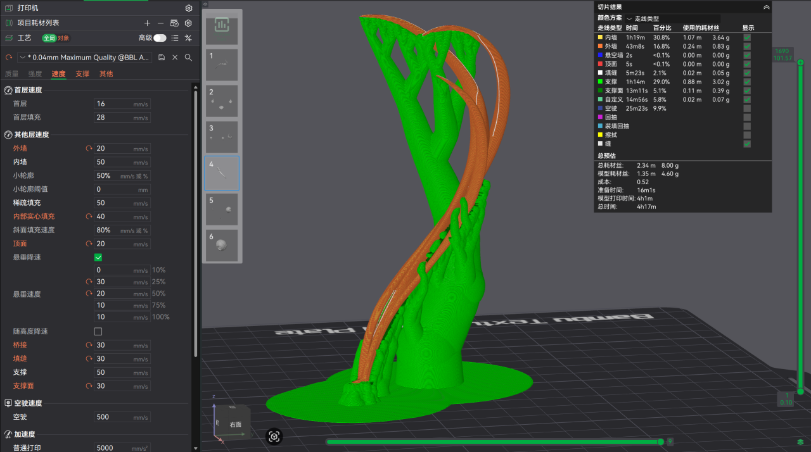

### 科学摆盘防止撞件

Bambu Studio 和 Prusa Slicer 都可以自动摆盘，但那是基于普通打印件的逻辑，不能活用于手办模型。
不规则、细长的手办模型通常需要手动调整方向，确保打印过程不会晃动，不会炒面。并且为了确保细节，最好让模型的细节面和z轴垂直，避免层高方向的锯齿纹理影响细节。为防止底板移动和降温影响，打印时使用逐件打印模式。

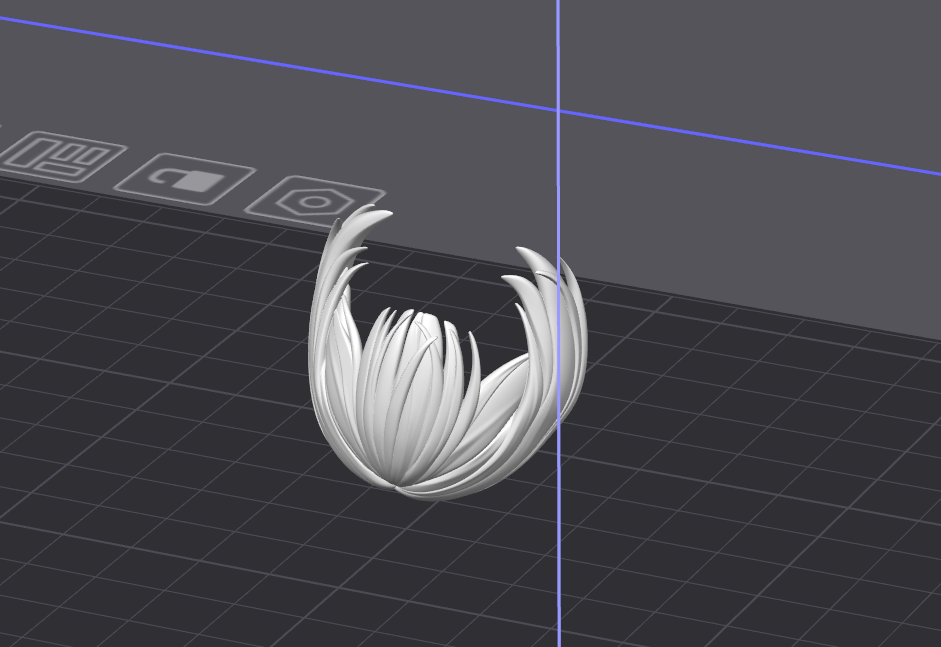

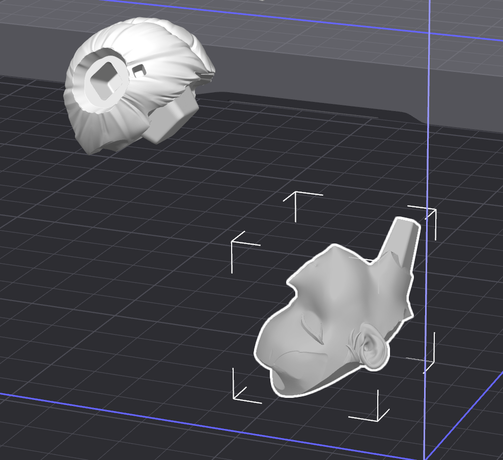

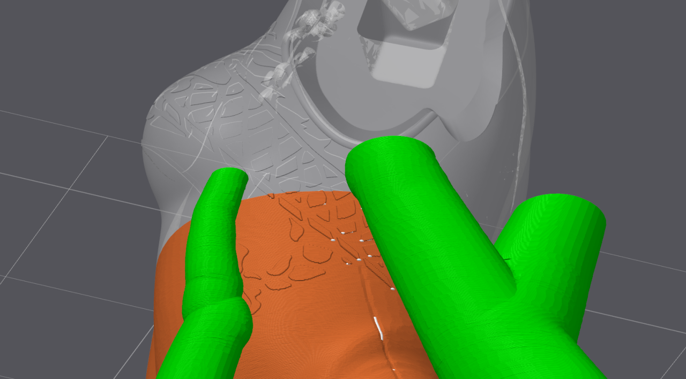

### 自定义支撑

有些地方不需要支撑，有些地方需要额外支撑。一般情况遵循以下原则：

- 细节较多处尽量通过摆盘避免支撑糊掉细节
- 细高件底部和周围需要保护性支撑，用于限位（参考火箭发射塔架）
- 榫头榫口处尽量避免大范围支撑，防止装配困难
- 底部不规则的模型，手动绘制更多支撑确保稳定

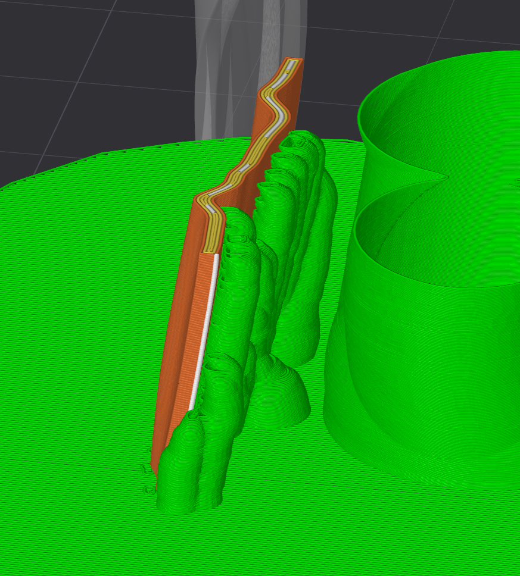

切片软件在0.2mm层高下生成的一些树状支撑，会出现bug导致支撑悬空，因此建议每次切片后进行检查。

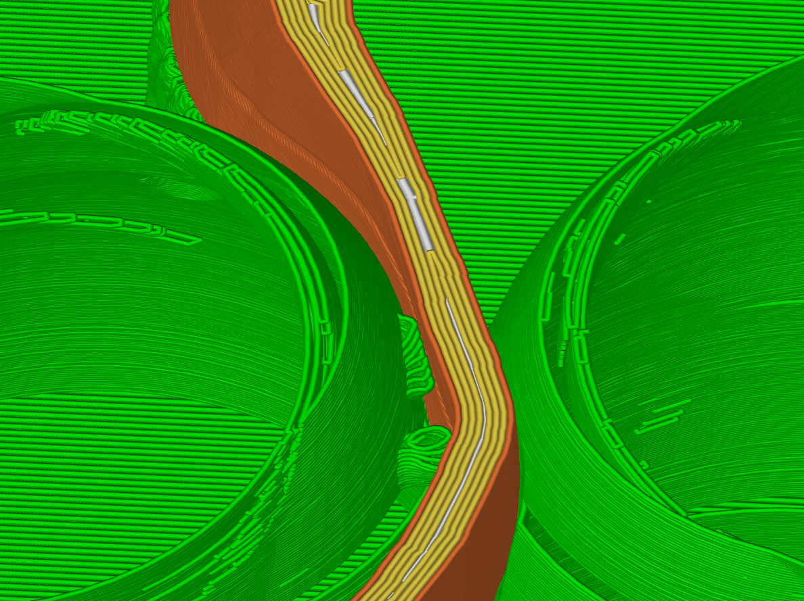

但是对于非常小的零件，还是全部裹上支撑比较安全。

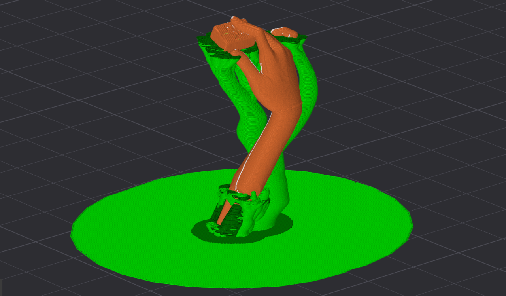

附一个技巧：如果头发过于细密，可以在头发间加入连接柱，一定程度可以防止头发晃动导致的明显层纹。

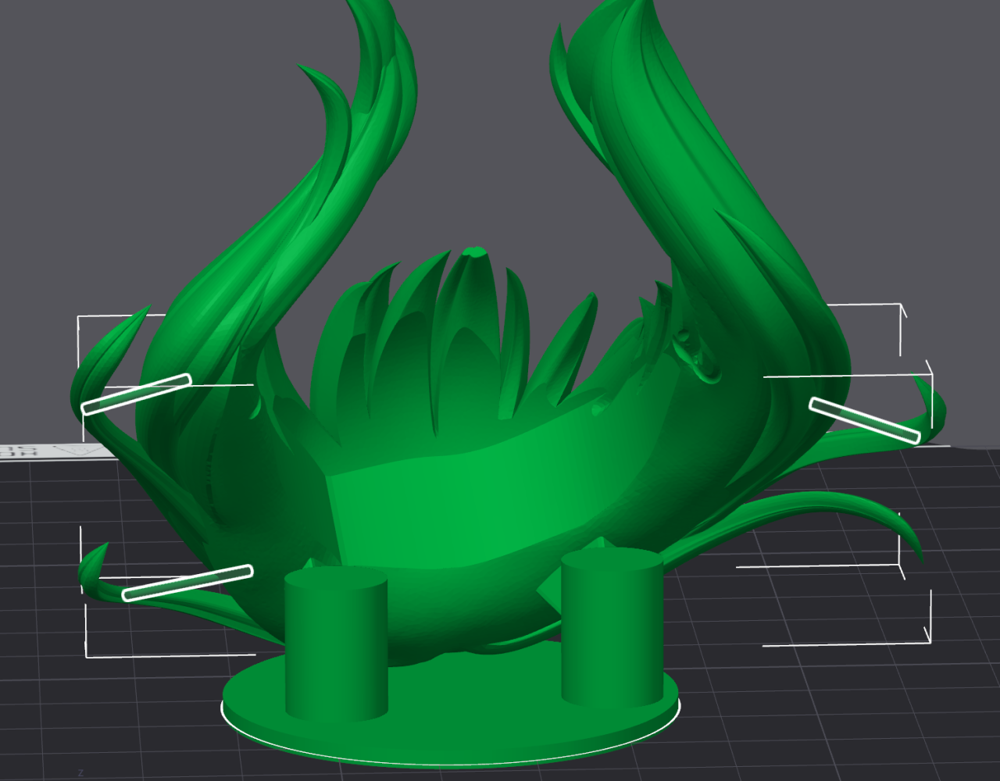

## 后处理

如果使用PLA，对于支撑部位和层纹较明显的地方可以用解胶剂进行软化，然后用细砂纸打磨，解胶剂使用市售的即可。

**操作细节：**

1. 使用解胶剂时，用棉签蘸取少量涂抹在需要处理的部位，大概数秒钟后会软化，可以用棉签轻轻擦拭软化的材料或者铺平表面层纹，注意解胶剂会渗透大约 0.5mm 的深度，应避免涂抹过量导致细节丢失或出现油画状表面。
2. 解胶剂使用后必须等待 5min 左右再进行打磨，否则材料仍然较软。
3. 打磨建议使用海绵砂纸，600目 -> 800目 -> 1000目。不需要过度打磨，可能出现抛光效果反而不好看。
4. 解胶剂未干的时候有粘性，假组可以在连接处涂一点解胶剂帮助连接。
5. 解胶剂有毒，注意通风。

## 喷漆

可以尝试喷点消光漆，降低表面反光度，上色实在不会，委托胶佬朋友吧……

## 成果展示

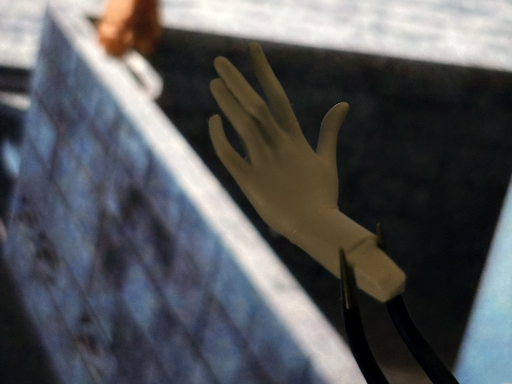

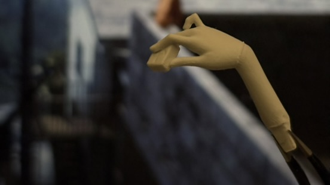

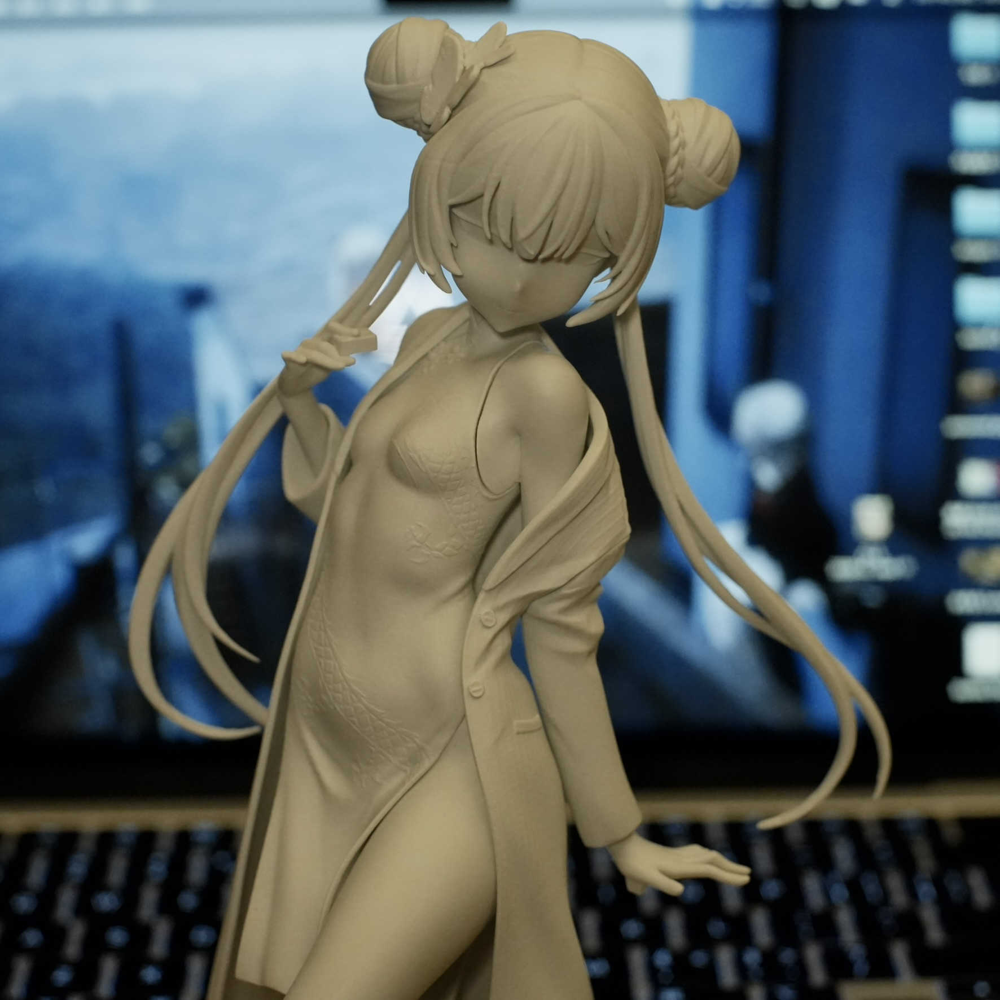

## 更多参考

[FDM3D打印手办表面质量优化指北](https://www.bilibili.com/video/BV1iETVzAEqk)

[FDM打印手办零打磨后处理教程](https://www.bilibili.com/video/BV1MRmqYmExu)

[3D打印层纹处理【工具篇】打磨工具/填眼灰推荐/底漆喷涂推荐](https://www.bilibili.com/video/BV1yi421Y7ta)
