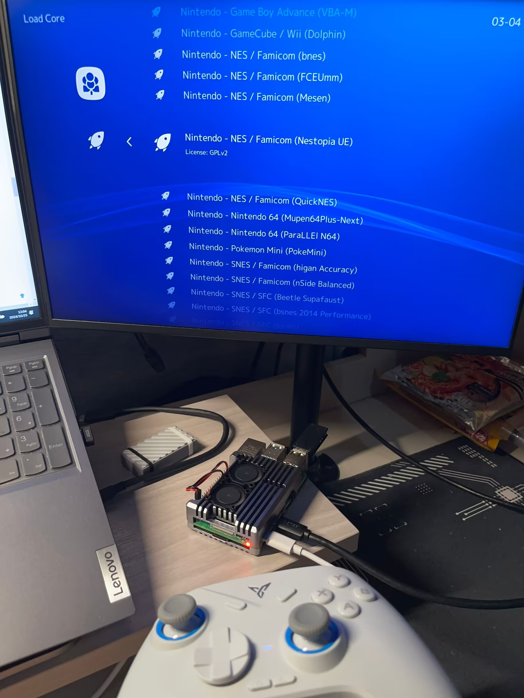

+++
title = "在树莓派上运行怀旧游戏——Lakka模拟器部署教程"
keywords = ["Emulator","RetroArch", "Technology","Raspberry Pi","Tutorial"]
description="Lakka模拟器部署教程"
date = "2024-10-27"
taxonomies = "1"
slug = "raspi-simulator-tutorial"
+++

## 前言

最近有点心痒，总想着要折腾点东西，于是把吃灰两年多的树莓派4b翻了出来。正经 Linux 想必是带不动的，手头上又正好有几个psp游戏，于是便想着装个模拟器，在 RetroPie 和 Lakka 之间选了界面更美观的 Lakka。



## 准备工作

### 需要准备的硬件

1. 一台电脑，一个树莓派（最好pi3及以上），或任何能安装Linux的机器
2. sd卡（32g及以上），或者一块硬盘
3. 输入输出设备（显示器、键盘或手柄）
4. 流畅、能上外网的网络连接

### 需要准备的软件

1. Raspberry Pi Imager，用于烧录镜像
2. SSH工具，推荐Termius或者MobaXterm用于建立连接
3. WinSCP，用于网络传送文件到树莓派

### 参考网站

[Lakka官网](https://www.lakka.tv/get/)

[树莓派系统烧录工具](https://www.raspberrypi.com/software/)

[个人常用的复古游戏资源站](https://www.oldemu.com/)

[WinSCP](https://winscp.net/eng/docs/lang:chs)

## 烧录系统

在 Lakka 官网下载对应系统的镜像，并用 Raspberry Pi Imager 烧录，可以不用设置任何东西。烧录完成会有提示。（在非树莓派机器上烧录，请查阅其他资料）

没什么问题的话，烧录完直接连接到树莓派上即可。插电开机，第一次启动会需要一些时间，稍等片刻。


  如果提示文件系统错误之类，属正常现象，等待120s后自动修复即可进入系统


## 做一些微小的工作


  Lakka原生支持有线无线手柄，以下内容均可使用一个手柄完成


进入系统界面后，使用手柄进入Wi-Fi，连接网络（需要和你的电脑在同一内网下），或者直接插网线，然后进入`设置->服务`，打开SSH和SAMBA协议；接下来在`菜单->系统信息->网络信息`界面查看本机ip地址`192.168.x.x`，记下来。

### 适当超频以获得更好的性能

对于树莓派4b，将sd卡插入电脑后，在【？？？】盘根目录下的config.txt中增加以下参数即可：

```bash
# overclock
over_voltage=6 # 增加电压
arm_freq=2000 # CPU 频率，单位是 MHz，最高 2147
gpu_freq=750 # GPU 频率，单位是 MHz
force_turbo=0 # 为确保安全，以动态频率运行
```

对于之前的机型，超频参数可以参考：
[树莓派如何超频](https://www.labno3.com/2021/01/08/how-to-overclock-the-raspberry-pi/)

### 系统空间扩容

烧录后系统的可用空间会比实际的存储介质容量小，所以需要扩容。
拿到地址后用SSH连接，账号密码均为`root`，然后依次执行下列命令：

```bash
systemctl stop retroarch
mv .config .config.bak
mv .cache .cache.bak
touch /storage/.please_resize_me
sync
reboot
```

正常情况下，系统会多次重启。喝杯水回来，重新打开SSH和SAMBA协议，再次用SSH连接，依次执行下列命令：

```bash
systemctl stop retroarch
rm -fr .cache .config .kodi
mv .config.bak .config
mv .cache.bak .cache
sync
reboot
```

### 设置中文

Lakka自带中文翻译，但是自带的字体中文显示不全，所以要替换字体。可以直接使用系统自带的微软雅黑，文件后缀为`.ttf`
使用WinSCP，选择SCP协议，用相同的地址、账号密码登录，然后进入`/tmp/assets/xmb/monochrome`下，将原本的`font.ttf`重命名为`font.ttf.bak`，然后将准备的字体文件重命名为`font.ttf`，复制到这个目录下。
随后，进入设置，将语言改为中文即可。

### 其他

Lakka可以折腾的地方很多，比如：

- 系统音视频设置
- 控制器键位设置
- 第三方成就
- 各种模拟器的内部设置
- 远程联机

这一部分就留给读者自行探索了。


  建议先备份一份配置文件`/storage/.config/retroarch/retroarch.cfg`，不小心折腾炸了可以进SSH手动恢复


## 游戏启动！

用WinSCP将游戏ROM放入`/storage/roms/`下（也可以用文件夹分类不同游戏机的游戏），然后在系统中选择`导入->扫描文件夹`页面，在这个目录下选择`<扫描此文件夹>`，等待片刻即可自动导入游戏。

实际测试中，树莓派4b可以完美高分辨率模拟运行除PSP以外的各种主机，PSP也可以在低于1080p的分辨率下流畅运行。不过运行时发热量略大，需要使用铝散热片或者散热壳加上风扇，否则可能降频。

## 后记

左边是LGBT，右边是玩家策划对立，2024年的游戏圈子属实不太安定。如果感到厌倦了，不妨把老游戏捡起来，那可是一座宝藏。
