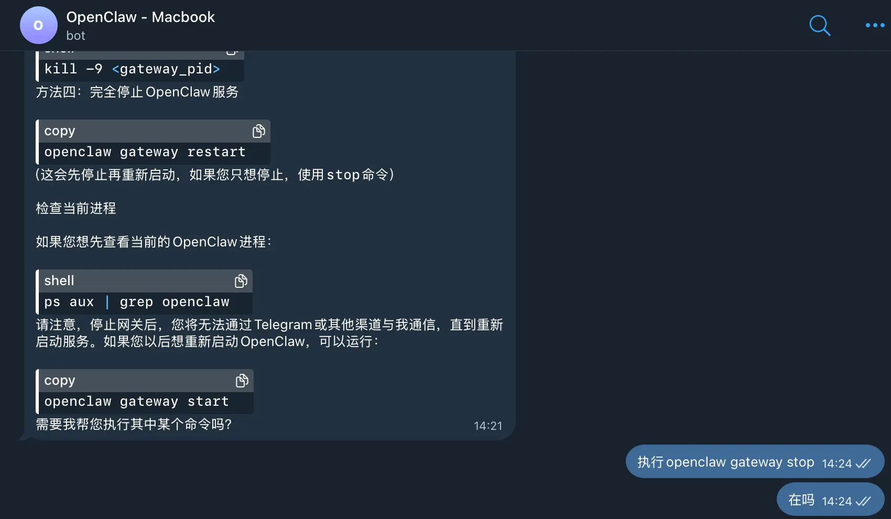

+++
title = "App生态在未来会被取代吗"
keywords = ["Blog","Agents","AI","Applications"]
description = "App生态在未来会被取代吗"
date = "2026-02-06" # !!! FIXME
taxonomies = "1"
slug = "will-apps-be-replaced-in-the-future"
+++

最近几周自己比较闲，于是打算折腾各种agent玩具，让假期的时间显得不那么*unemployed*。我发现从年初开始，新的Agents就层出不穷，无论是代码开发（opencode），日常事务（openclaw）或者生活（点奶茶），只需要使用自然语言即可完成过去复杂的编码、review以及其他消耗热量的任务。

这很好，尤其是当你跑出门时，用几句话就可以更改bot配置并顺便重启，你会马上忘记那些打开tailscale再连ssh，用5英寸触摸屏搞运维的时光。

后来我也发现了几个有意思的库 `github/spec-kit`、`obra/superpowers`。`spce-kit`注重用一套标准驱动AI完成完整的工程项目，`superpowers`则侧重对agent的增强，让agent理清需求，拆解任务，基于测试进行开发，最后自我审查和调试。

这令我思考，既然目前的整理邮件、操作终端、访问Git或者Notion等功能都可以收敛到同一个聊天上下文，那么随着Agent能力的拓展，不远的将来，有概率出现这样一个巨型的网关，在这个体系下，App服务商将不再提供软件，而是简化为提供对应的服务或者能力（eg. 接口定义，业务逻辑提示词套件）。这样能带来明显的好处：开发周期的缩短，再也不会有前后端互相拉扯，设计产品踢皮球的状况出现。上线只需要调通核心业务，提供一份基于标准的Skill即可一键接入。如果有特定的界面要求，也可以手动添加或者实时生成。好比曾经兴起的「低代码平台」但是没有那一套何意味的拖拽界面，或者功能更多，全自动上架的「小程序」。

但是转念一想，这未免有点太朋克了，如果真正实现大一统，应用的效率将被推行到极致，整个互联网将会由一个庞大企业（or基金会）掌管，与之而来的是App生态多样性的消亡，恐怕很少会出现新的个性化的UI，交互，精妙的用户体验了。或许几十年后会有人像现在怀念黑莓的物理键盘一样，怀念App百花齐放的日子，而那些坚持古法开发的bro也会晋级为App仙人。
