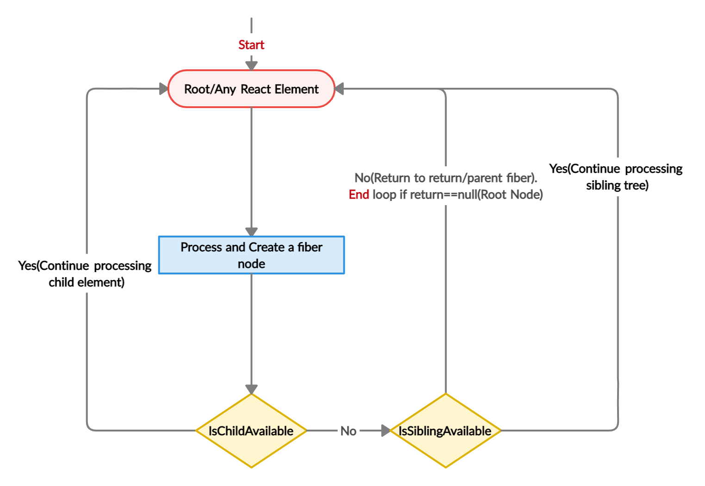

+++
title = "React Fiber流程简介"
keywords = ["Blog","Frontend",'React',"Reconciliation"]
description = "React Fiber流程简介"
date = "2025-04-16"
taxonomies = "1"
slug = "react-fiber-reconciliation"
+++

> 摘自自己的前端笔记

## 简要概括

**协调算法**是 React 在更新 UI 时的工作流程，目的是确定哪些部分的UI需要更新。React Fiber是React 16引入的新的**协调算法**。

在 React 16 之前，组件树更新是通过递归方式进行的，称为**堆栈调和（Stack Reconciliation）**，这种方式一旦开始**无法中断**，直到**遍历完整个组件树**。这种机制在处理大量数据或复杂视图时，可能导致**主线程阻塞**，从而影响应用对用户输入和其他高优先级任务的响应。

React Fiber 是对协调器的重写，完全向后兼容。React 的新协调算法被称为 Fiber Reconciler，主要目标是**增量渲染**，优化 UI 动画、手势和用户交互响应性。它允许将**工作分为多个块**，并将**渲染分为多个帧**。此外，*Fiber* 引入了**优先级**、暂停、复用和中止工作的能力。*Fiber* 可视为 React 自定义的**带链接关系**的**DOM 树**，每个 *Fiber* 代表一个**工作单元**，React 可根据剩余时间决定是否完成该工作，必要时可中断并恢复。

## 核心

Fiber 的**核心特性**是**中断和恢复**，这一特性大幅增强了 React 的**并发**性和**响应**性。

React判断*Fiber*是否有足够时间完成任务的机制是：检查任务优先级（用户输入/动画>非关键内容>懒加载）

### 中断

可**中断**的能力是React并发模式（Concurrent Mode）的核心，这种能力使得React可以优先处理高优先级的更新，而推迟低优先级的更新。（很复杂，但是类似OS的中断/挂起，会保存上下文等等）

### 增量渲染

React将渲染任务分成每个*Fiber*单元，包含组件状态、生命周期、DOM操作等信息。React按照*Fiber*的优先级逐一执行

## Fiber 的结构

一个 *Fiber*（文章里用斜体*Fiber*表示）是一个简单的 JavaScript 对象。它代表 React 元素或 DOM 树的一个节点。它是一个工作单位。相比之下，Fiber 是 React Fiber 的协调器。

在第一次渲染时，React 会浏览每个 React 元素并创建一棵 *fibers* 树。**虽然我们称之为树，但 React Fiber 创建了一个节点的链表，其中每个节点都是一个 *fiber*。** 并且在父、子和兄弟姐妹之间存在着一种关系。React 使用一个 *return* 键来指向父节点，任何一个子 *fiber* 在完成工作后都应该返回该节点；React也有指向子节点、兄弟节点的指针。

*Fiber*节点的结构如下：

```JavaScript
function FiberNode(
  this: $FlowFixMe,
  tag: WorkTag,
  pendingProps: mixed,
  key: null | string,
  mode: TypeOfMode,
) {
  // 基本属性
  this.tag = tag; // 描述此Fiber的启动模式的值（LegacyRoot = 0; ConcurrentRoot = 1）
  this.key = key; // React key
  this.elementType = null; // 描述React元素的类型。例如，对于JSX<App />，elementType是App
  this.type = null; // 组件类型
  this.stateNode = null; // 对于类组件，这是类的实例；对于DOM元素，它是对应的DOM节点。

  // Fiber链接
  this.return = null; // 指向父Fiber
  this.child = null; // 指向第一个子Fiber
  this.sibling = null; // 指向其兄弟Fiber
  this.index = 0; // 子Fiber中的索引位置

  this.ref = null; // 如果组件上有ref属性，则该属性指向它
  this.refCleanup = null; // 如果组件上的ref属性在更新中被删除或更改，此字段会用于追踪需要清理的旧ref

    // Props & State
  this.pendingProps = pendingProps; // 正在等待处理的新props
  this.memoizedProps = null; // 上一次渲染时的props
  this.updateQueue = null; // 一个队列，包含了该Fiber上的状态更新和副作用
  this.memoizedState = null; // 上一次渲染时的state
  this.dependencies = null; // 该Fiber订阅的上下文或其他资源的描述

    // 工作模式
  this.mode = mode; // 描述Fiber工作模式的标志（例如Concurrent模式、Blocking模式等）。

  // Effects
  this.flags = NoFlags; // 描述该Fiber发生的副作用的标志（十六进制的标识）
  this.subtreeFlags = NoFlags; // 描述该Fiber子树中发生的副作用的标志（十六进制的标识）
  this.deletions = null; // 在commit阶段要删除的子Fiber数组

  this.lanes = NoLanes; // 与React的并发模式有关的调度概念。
  this.childLanes = NoLanes; // 与React的并发模式有关的调度概念。

  this.alternate = null; // Current Tree和Work-in-progress (WIP) Tree的互相指向对方tree里的对应单元

    // 如果启用了性能分析
  if (enableProfilerTimer) {
    // ……
  }

    // 开发模式中
  if (__DEV__) {
    // ……
  }
}
```

可以看到每个节点都有自己的属性、元素类型、父子兄弟关系、状态和副作用。

为什么*fiber*比之前的递归DOM更快？就是因为使用flags标记当前节点和子树的副作用类型，减少节点遍历。并且调和过程可被中断。

## 建立阶段

建立阶段确定哪些部分的UI需要更新，会比较当前的树*current*和正在工作的树*workInProgress*。

当前被刷新用来渲染用户界面的树，被称为 *current*，它用来渲染当前用户界面。每当有更新时，Fiber 会建立一个 *workInProgress* 树，它是由 React 元素中已经更新数据创建的。React 在这个 *workInProgress* 树上执行工作，并在下次渲染时使用这个更新的树。一旦这个 *workInProgress* 树被渲染到用户界面上，它就成为 *current* 树。

两个阶段：

1. 判断*fiber*是否要更新，创建与标记更新节点
2. 收集副作用列表




最终的fiber树：


## 更新阶段

对于每次更新，它都会建立一个 *workInProgress* 树。它从根 *fiber* 开始，遍历该树，直到叶子节点。与初始渲染阶段不同，它不会为每个 React 元素创建一个新的 *fiber* 。它只是为该 React 元素使用预先存在的 *fiber* ，并在更新阶段合并来自更新元素的新数据和 props。

React Fiber 将更新划分为工作单元。它可以为每个工作单元分配优先级，并有能力暂停、重用或在不需要时中止工作单元。 React Fiber 将工作分为多个工作单位，也就是 *fiber* 。它将工作安排在多个框架中，并使用来自 *requestIdleCallback* 的 *deadline* 。每个更新都有其优先级的定义，如动画，或用户输入的优先级高于从获取的数据中渲染项目的列表。Fiber 使用 *requestAnimationFrame* 来处理优先级较高的更新，使用 *requestIdleCallback* 处理优先级较低的更新。因此，在调度工作时，Fiber 检查当前更新的优先级和 *deadline* （帧结束后的自由时间）。

如果优先级高于待处理的工作，或者没有 *截止日期* 或者截止日期尚未到达，Fiber 可以在一帧之后安排多个工作单元。而下一组工作单元会被带到更多的帧上。这就是使 Fiber 有可能暂停、重用和中止工作单元的原因。

## 渲染阶段

### 开始

workLoop会判断每个*fiber*是否有待处理的工作，没有则跳过已经处理过的fiber。

如果有子 *fiber* ，*beginWork*函数返回子 *fiber* ，如果没有子 *fiber* 则返回空。函数 *performUnitOfWork* 持续迭代并调用子 *fiber* ，直到叶节点到达。在叶子节点的情况下，*beginWork* 返回 null，因为没有任何子节点，*performUnitOfWork* 函数调用 *completeUnitOfWork* 函数。现在让我们看看完善阶段。

### 完善

这个 *completeUnitOfWork* 函数通过调用一个 *completeWork* 函数来完成当前单位的工作。如果有的话，*completeUnitOfWork* 会返回一个同级的 *fiber* 来执行下一个工作单元，如果没有工作的话，则会完成 return(parent) *fiber* 。这将一直持续到返回值为空，也就是说，直到它到达根节点。和 *beginWork* 一样，*completeWork* 也是一个发生实际工作的函数，而 *completeUnitOfWork* 是用于迭代的。

渲染阶段的结果会产生一个效果列表（副作用）。这些效果就像插入、更新或删除宿主组件的节点，或调用类组件节点的生命周期方法。这些 *fiber* 被标记为各自的效果标签。

### 提交

在这里，*workInProgress* 树成为 *current* 树，因为它被用来渲染 UI。实际的 DOM 更新，如插入、更新、删除，以及对生命周期方法的调用或者更新相对应的引用 —— 发生在 effect 列表中的节点上。

## 参考资料

[fiber架构的原理和工作模式](https://segmentfault.com/a/1190000044468085)

[fiber简介（机翻）](https://juejin.cn/post/7006612306809323533)
